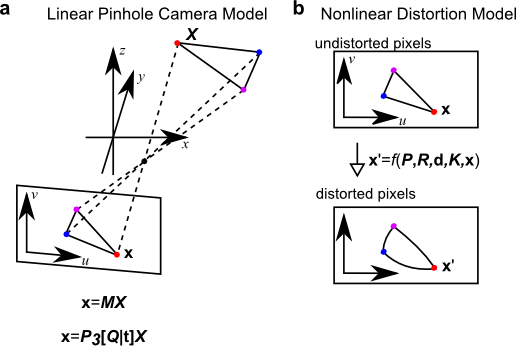

Camera Model
============

single camera model
-------------------

The core of PyMVG is a camera model that is compatible with the
calibration outputs of `OpenCV <http://opencv.org>`_ and
`MultiCamSelfCal <https://github.com/strawlab/MultiCamSelfCal>`_.

In the above image, you can see that this camera model consists of a
linear pinhole projection model followed by a nonlinear distortion
model. The pinhole model is specified completely by the 3x4 matrix M
(or, equivalently, the 3x3 intrinsic matrix P, the 3x3 ortho-normal
rotation matrix Q, and the translation vector t). The nonlinear
distortion model is specified completely by elements of the intrinsic
matrix of the pinhole model and several distortion terms.

camera system (multiple cameras)
--------------------------------

PyMVG represents a camera system with the MultiCameraSystem class. You
create an instance with a list of individual camera instances. The
class provides additional methods for triangulation of 3D points and
so on.
